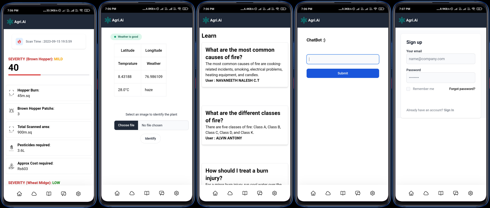

# Pest-detection-system
A system to detect pests using YOLOv8 AI and a companion app to help prevent and mitigate the pest attack. 
An AI drone flies over the field to detect the pest affected areas and report the findings to the farmer's mobile app. Another AI model can detect the individual pests to determine the appropriate action.
In addition to detection, the app has weather prediction to help the farmer to prepare better, a GPT3 chatbot and a forum to be better informed.

## App


[You can use the app here](https://maxq1017-agri-hack-2023.vercel.app/chat)

## How to run the AI models in your PC:

Install YOLOv8
```
pip install ultralytics 
```

Clone this repo 
```
git clone https://github.com/devalopr/Pest-detection-system
```

### We trained 3 AI models using YOLOv8 to detect pests. Choose your models based on numebrs.
```
1: BPH Burn Model
2: BPH Pest Model
3: Wheat Pest Model
```

Run 
```
python main.py
``` 


